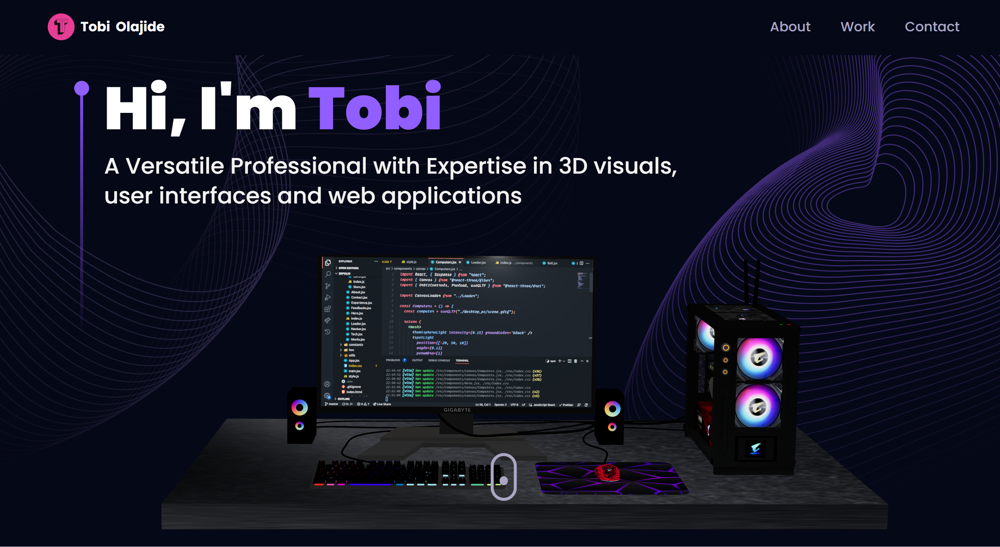
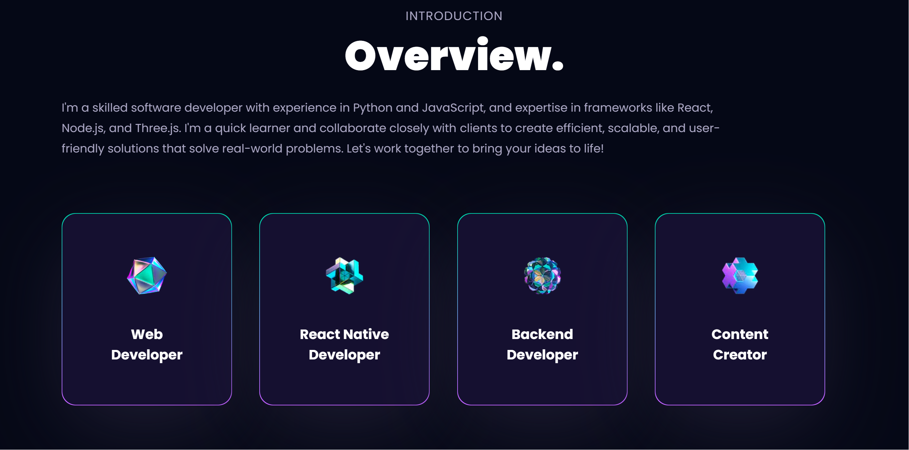
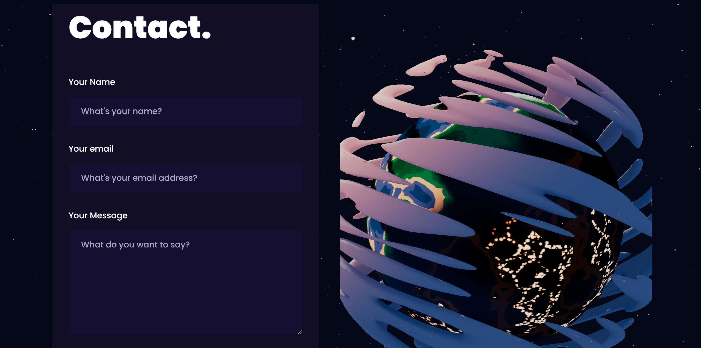

# My Portfolio 
  
## Description 
  
My portfolio upgraded to utilize React 18 and Three.js. Highlights my strongest work as a developer.

### User Story
> AS A web devoloper being able to showcase my skills to potential employers is an important aspect of getting recruited
>
>I WANT a portfolio of work which highlights my strongest work with links to deployed applications and their repositories.
>
>SO THAT recruiters can easily view and access my proficiency as a web developer across various devices.

---
## Table of Contents

* [Description](#description)
* [Installation](#installation)
* [Usage](#usage)
* [License](#license)
* [Contributors](#contributors)
* [Credits](#credits)
* [Questions](#questions)

---
## Installation

- Clone repo

        git clone https://github.com/Thorbieey/3D-Portfolio.git
        

- Initialize npm and install dependencies

- Run application in command line

        npm run dev

- Open [http://localhost:3000](http://localhost:5173) to view it in your browser.

---
## Usage 

### Repository

* The URL of the GitHub repository: 
[https://github.com/Thorbieey/3D-Portfolio.git](https://github.com/Thorbieey/3D-Portfolio.git)

* The URL of the deployed application: 
[https://tobiolajide-portfolio.netlify.app/](https://tobiolajide-portfolio.netlify.app/)

### Screenshots/Demo

---
## License

This application is covered under: **The MIT License**. Learn more about [choosing licenses](https://choosealicense.com/licenses/).

---
## Contributors

When contributing to this repository, please first discuss the change you wish to make via email, issue, linkedIn or any other method with the owner of this repository before making a change. 

### Pull Request Process

1. Fork the repository

2. Create a feature branch.

        git checkout -b name/feature/new-feature

3. Add and commit your changes.

        git add .
        git commit -m "short description of feature"

4. Push your contribution to the created branch.

        git push

5. Submit a new Pull Request on GitHub.

---
## Credits

- [Would you also like to build this portfolio ?](https://stupendous-bavarois-a70c16.netlify.app/)

- [Learn how to dominate your bootstrap nav-bar collapse on **slack**](https://stackoverflow.com/questions/48248975/bootstrap-navbar-collapse-dont-work-react-create-react-app)

- [Learn about upgrading to **React 18**](https://reactjs.org/blog/2022/03/08/react-18-upgrade-guide.html#updates-to-client-rendering-apis)

---
## Questions

Got any additional questions/enquiries? Reach out to **Tobi Olajide** via:

Email: tobiolajide223@gmail.com

GitHub: [Thorbieey](https://github.com/Thorbieey)

LinkedIn: https://www.linkedin.com/in/tobi-olajide/

  
---